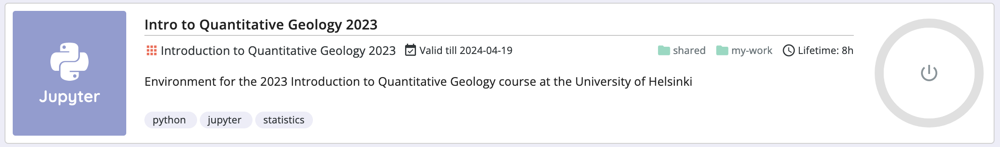

Course environment
==================

The environment for this course is quite similar to that of the `Geo-Python course <https://geo-python.github.io>`__ that many of you may have already taken.
Thus we present here only details that are relevant for this course in the points below.
For all other items, we suggest you check the description of the `Geo-Python course environment <https://geo-python-site.readthedocs.io/en/latest/lessons/L1/course-environment-components.html>`__.

1. `Cloud computing environments`_ CSC Notebooks or Binder
2. `Discord`_ for communicating among UH students

Cloud computing environments
----------------------------

We will use cloud-based computing environments (CSC Notebooks or Binder) to access interactive online version of the lessons
and to work on the weekly exercises. You can use the cloud computing environments with any computer as long as it has a reasonably fast internet connection and a web browser.

Please note that the Binder cloud computing environment is completely **temporary**, and only files stored in the ``my-work`` folder in the CSC Notebooks will be preserved on that platform. Thus you should always remember to push your changes to GitHub!

.. figure:: img/launch-buttons.png
   :alt: Launch buttons
   :width: 700px

   Different options for making the lesson interactive

Each interactive lesson and exercise will have a launch button for both CSC Notebooks and Binder.
The CSC notebooks environment is preferred, but only accessible to students from Finnish universities and research institutes.

CSC Notebooks
~~~~~~~~~~~~~

Notebooks by CSC (https://notebooks.csc.fi) is a computing environment hosted by the Finnish IT Center for Science (CSC). The CSC Notebooks platform is used for running Jupyter Notebooks in a customized environment.
CSC Notebooks is available only for students who are affiliated with Finnish universities and research institutes (via the Haka user authentication).

.. note:: **When using the CSC Notebooks for the first time, you need to join the group created for this course:**

    1. Log in at https://notebooks.csc.fi/
    2. Select Haka for the authentication provider
    3. Enter your Finnish university login credentials
    4. Click on the **Join workspace** button on the top left
    5. Join the Introduction to Quantitative Geology workspace using the join code ``int-moejb8zz``

    After joining the group, you should be able to view the course environments called `Introduction to Quantitative Geology 2023` near the top of the Application list.

.. figure:: img/CSC_join_group.png
   :alt: Join Group in CSC Notebooks

   Launching the instance takes a few moments.

.. note:: **After launching the Introduction to Quantitative Geology 2023 workspace the first time:**

    1. Double-click on the ``my-work`` folder in the file navigator on the left side of the Jupyter Lab window
    2. Click on the Git icon on the left side
    3. Click on the **Clone a Repository** button
    4. Enter the address ``https://github.com/IntroQG/notebooks.git`` and click **Clone**
    5. You can now access the lesson notebooks in the ``my-work/notebooks`` folder

.. note:: **Repeat these steps every time when starting to work on a programming task using the CSC Notebooks:**

    1. Log in at https://notebooks.csc.fi/
    2. Select Haka for the authentication provider
    3. Enter your Finnish university login credentials
    4. Click on the **Start session** button for the Introduction to Quantitative Geology 2023 workspace
    5. Navigate to the ``my-work/notebooks`` directory, click on the Git icon on the left and click the **Pull latest changes**
    
.. figure:: img/pull-changes.png
   :alt: Pulling the latest notebook changes

**Remember to save your work!**

Binder
~~~~~~

Binder (https://mybinder.org/) also runs Jupyter Notebooks in your web browser in a customized environment. The original files (notebooks) are hosted on GitHub.
Binder does not require the user to log in, you can just click on the link in the lesson / exercise and start working.

.. figure:: img/Binder_loading.png
   :alt: Binder loading
   :width: 700px

   Binder takes a few moments to load

Once the instance is ready, you can navigate to the lesson folders and start working with existing notebooks or create a new one.

**Remember to save your work! The Binder instance is temporary, and all your files will be lost after the session.**

Using your own computer
-----------------------

We recommend that everyone use the available `cloud computing environments`_ during this course.
In case you want to work on your own computer, you will need to `install Python (via Miniconda) <../../general-info/installing-miniconda.html>`_.

Discord
-------

During the course we will use actively an application called `Discord <http://discord.com>`__ for discussion and questions about the lessons and exercises.
All enrolled students have received an invite link to the `introqg2023` workspace at the start of the course.
`Read more about Discord on the `Geo-Python website <https://geo-python-site.readthedocs.io/en/latest/lessons/L1/discord-usage.html>`__.